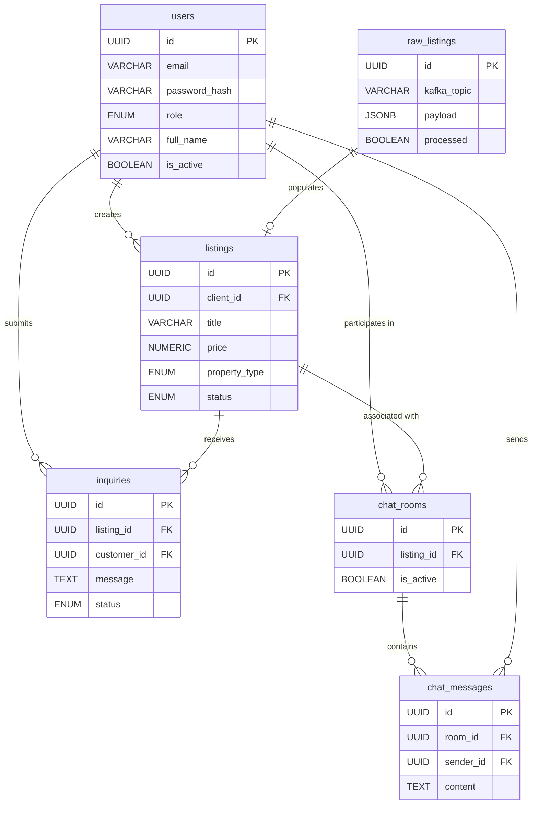

# RealEstate.io — High-Performance Property Intelligence Platform
## Enterprise Real Estate Ecosystem with Event-Driven Data Pipelines

[](https://fastapi.tiangolo.com/)
[](https://reactjs.org/)
[](https://kafka.apache.org/)
[](https://airflow.apache.org/)
[](https://www.postgresql.org/)
[](https://render.com/)
[](https://vercel.com/)

**RealEstate.io** is a premium, full-stack real estate marketplace engineered for high-scale property management and market intelligence. It bridges the gap between traditional real estate transactions and modern data science by implementing a robust, event-driven architecture and automated analytical workflows.

---

## 🏗️ System Architecture

The platform is built on a distributed microservices pattern, prioritizing high availability, data consistency, and low-latency communication.


---

## 📊 Database Entity-Relationship (ER) Schema

The OLTP database is designed in PostgreSQL to handle high-concurrency transactions, user messaging, and raw data ingestion.



---

## 🧬 Data Engineering Foundations

This project serves as a showcase for core **Data Engineering (DE)** principles applied to a real-world production environment. It successfully implements **18 out of 30 Advanced Data Engineering concepts**, intentionally trading legacy Big Data tools (Hadoop) for a **Modern Data Stack**.

### 1. Event-Driven Architecture (EDA) & Streaming
Instead of direct database writes for critical actions, the system utilizes **Apache Kafka** as a central nervous system. Every listing creation or inquiry is emitted as a structured **Avro event** validated by a **Confluent Schema Registry**, ensuring decoupled systems and strict data quality.

### 2. Scalable Orchestration & ETL
Leveraging **Apache Airflow**, the system manages complex dependencies through directed acyclic graphs (DAGs). 
- **ETL Pipelines**: Extracts data from Postgres, transforms it via external logic, and loads it back.
- **Enrichment**: Hourly tasks compute architectural metrics (Price/Sqft) and neighborhood health scores.

### 3. Data Ingestion & Idempotency
The system supports **Bulk CSV Ingestion** via the Admin dashboard. To prevent duplicate listings, the pipeline utilizes cryptographic fingerprinting (SHA-256) of property attributes to ensure that raw ingestion data is sanitized and unique before being promoted to the public marketplace.

### 4. Cloud Infrastructure & Networking
The platform is fully containerized using **Docker** and deployed across modern cloud providers. The React frontend is served via a global CDN on **Vercel**, while the FastAPI backend and PostgreSQL database are hosted on **Render**, communicating over secure internal networks.

---

## 💎 Premium Features

- **Real-Time Communication**: Secure, authenticated chat system for direct owner-to-buyer negotiation.
- **Geospatial Intelligence**: Interactive map integration with cluster rendering and property-specific overlays.
- **Glassmorphism UI**: A state-of-the-art interface designed for professional use, featuring refined dark/light modes and fluid transitions.
- **Admin Command Center**: Advanced management suite for verification, bulk ingestion, and data extraction.

---

## 🚀 Deployment

The entire ecosystem is containerized for seamless scaling and reproducible environments.

### Local Development (Docker Compose)
```bash
# Start the full infrastructure (Postgres, Kafka, Zookeeper, Airflow, Backend, Frontend)
docker-compose up -d --build
```

### Production Cloud Deployment
- **Frontend**: Deployed as a Static Site on Vercel (`vercel.json` configured for SPA routing).
- **Backend**: Deployed as a Dockerized Web Service on Render.
- **Database**: Managed PostgreSQL instance on Render.

---

## 📈 Platform Lifecycle
`Raw Event` → `Kafka Buffer` → `Validation` → `Deduplication` → `Market Enrichment` → `Live Transaction` → `BI Rollup` → `ML Training`
