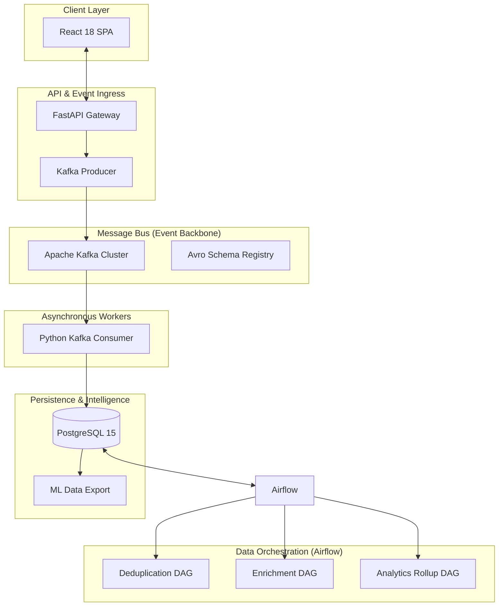

# RealEstate.io — High-Performance Property Intelligence Platform
## Enterprise Real Estate Ecosystem with Event-Driven Data Pipelines

[](https://fastapi.tiangolo.com/)
[](https://reactjs.org/)
[](https://kafka.apache.org/)
[](https://airflow.apache.org/)
[](https://www.postgresql.org/)

**RealEstate.io** is a premium, full-stack real estate marketplace engineered for high-scale property management and market intelligence. It bridges the gap between traditional real estate transactions and modern data science by implementing a robust, event-driven architecture and automated analytical workflows.

---

## 🏗️ System Architecture

The platform is built on a distributed microservices pattern, prioritizing high availability, data consistency, and low-latency communication.



---

## 🧬 Data Engineering Foundations

This project serves as a showcase for core **Data Engineering (DE)** principles applied to a real-world production environment:

### 1. Event-Driven Architecture (EDA)
Instead of direct database writes for critical actions, the system utilizes **Apache Kafka** as a central nervous system. Every listing creation, view, or inquiry is emitted as a structured **Avro event**, ensuring decoupled systems and high fault tolerance.

### 2. Idempotency & Data Quality
Duplicate listings are a common pain point in real estate. The **Deduplication DAG** utilizes cryptographic fingerprinting (SHA-256) of property attributes to ensure that "raw" ingestion data is sanitized and unique before being promoted to the public marketplace.

### 3. Scalable Orchestration & ETL
Leveraging **Apache Airflow**, the system manages complex dependencies through directed acyclic graphs (DAGs). 
- **Enrichment**: Hourly tasks compute architectural metrics (Price/Sqft) and neighborhood health scores.
- **State Management**: Automated flagging of "stale" listings ensures market freshness.

### 4. Transactional to Analytical (OLAP)
Raw event streams are "rolled up" daily into high-performance analytical tables. This allows the platform to serve complex business intelligence (Sales Velocity, Negotiated Deltas) without impacting the performance of the transactional database.

### 5. Machine Learning Lifecycle (MLOps Bridge)
The system treats "Sales" not just as transactions, but as **ground-truth labels**. By capturing the delta between List Price and Sold Price, the platform provides a one-click **ML Export Pipeline** to feed high-quality data into valuation models.

---

## 💎 Premium Features

- **Real-Time Communication**: Secure, authenticated chat system for direct owner-to-buyer negotiation.
- **Geospatial Intelligence**: Interactive map integration with cluster rendering and property-specific overlays.
- **Glassmorphism UI**: A state-of-the-art interface designed for professional use, featuring refined dark/light modes and fluid transitions.
- **Admin Command Center**: Advanced management suite for verification, bulk ingestion, and data extraction.

---

## 🛠️ Technical Stack

- **Frontend**: React 18, Vite, Tailwind-inspired Vanilla CSS, Leaflet.js, Framer Motion.
- **Backend**: FastAPI, SQLAlchemy (Asynchronous support), Pydantic.
- **Streaming**: Confluent Kafka, Avro Serialization.
- **Orchestration**: Airflow 2.8 (Celery Executor ready).
- **Database**: PostgreSQL 15 (Relational storage with JSONB for flexible amenities).

---

## 🚀 Deployment

The entire ecosystem is containerized for seamless scaling and reproducible environments.

```bash
# Start the full infrastructure
docker-compose up -d

# Backend Setup
cd backend && pip install -r requirements.txt
uvicorn main:app --reload

# Frontend Setup
cd frontend && npm install && npm run dev
```

---

## 📈 Platform Lifecycle
`Raw Event` → `Kafka Buffer` → `Validation` → `Deduplication` → `Market Enrichment` → `Live Transaction` → `BI Rollup` → `ML Training`
